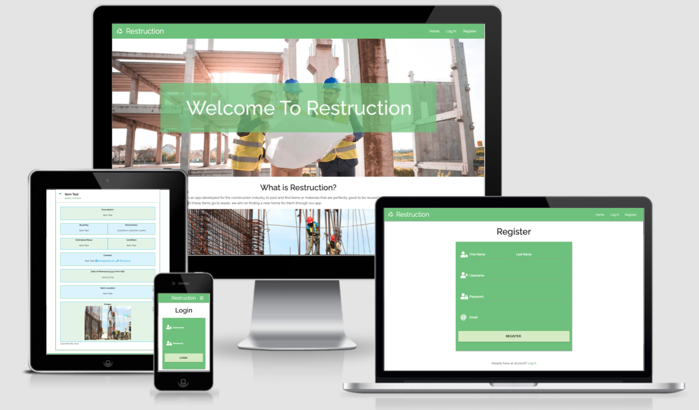
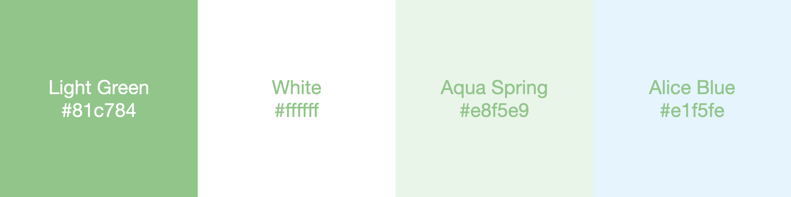
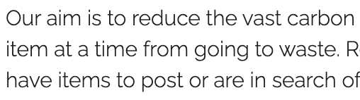
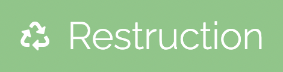

<h1 align="center">Restruction</h1>
<h1 align="center"></h1>

<a href="https://restruction.herokuapp.com/"> : Restruction Deployed on Heroku</a>

<a href="https://github.com/marcusnolan/restruction"> : Restruction Github Repository</a>

## About
The Restuction app was developed to try and create a database where professionals from the construction industry can either advertise or find items 
(materials or objects), that are still very usable but are going to be destroyed or removed form a building due to refurbishment or demolition. This effort 
is to try and combat the 40% that the construction industry claims of the worlds total carbon production every year.  
 
A lot of this carbon produced is from materials and objects that are being produced for new buildings even though there are perfectly got alternatives available. 
anot only does the production of these items produce carbon but the packaging and shipping can often produce even more carbon than the product itself. If Restruction
can help just one item from unnecessarily being destroyed, it is a victory!

## Table of Contents
**[User Experience](#user-experience)** 

**[Features](#features)**

**[Technologies Used](#technologies-used)**

**[Testing](#testing)**

**[Deployment](#deployment)**

**[Bugs](#bugs)**

**[Credits](#credits)**

## User Experience

### User Stories
- #### As a general user;
    1. I want to be informed about Restruction's concept.
    2. I want to be able to navigate the website easily. 
    3. I want to see some sample items without having to register or login. 
    4. I want to easily find the register page and login page. 
- #### As a construction industry professional;
    1. I want to understand the format and types of items being displayed without having to register or login. 
    2. I want to be prompted to register as a user. 
    3. I want to easily find the register and login page's. 
    4. I want to be able to post item's myself easily. 
    5. I want to be able to view items and search for items by their name. 
    6. I want to be able to view iamges of items and upload my own images of items I have posted. 
    7. I want to be able to edit and delete items I have posted. 
    8. I want to be able to edit my account. 
    9. I want to be able to set specific contact details for the items I post. 
    10. I want to set a date for which the item will be removed. 

### Design

- #### Colour Scheme
    - The Universal colour for recycling is green. It has always been recognised as that so naturally, I felt Restruction should have green as the main colour. 
    I also wanted it to be light and welcoming to give a positive vibe and emotion as the aim and ethos of Restruction is that of positivity and optimism.
    - The main colour is De York (essentially a Light Green). The Secondary colour is white. The 2 remaining colours in the pallet below are the alternating 
    background colours for the items dropdowns and are Aqua Spring and Alice Blue.  
     
    

- #### Typography
    - The Font used throughout the entire website is Raleway. It is a very clean font which I wanted as in general, I want the website to be clean to give the 
    feeling that it and the items posted on it are prestine. 
     
    

- #### Imagery
    - For the Restruction logo, I have used the Universal Recycling Symbol that was originaly designed by a college student back in 1970. As is described in its name, 
    it is universal and one of the most recognizable icons in the world. I used Font Awesome (fa-recycle) and Raleway font saying "Restruction" to create the logo. 
    It is very simple and clean and because it does not feature an image, it is always brilliant quality no matter what screen resolution.  
    
    - The images on the home page are royalty free images I downloaded from both <a href="https://pixabay.com/">Pixabay</a> and <a href="https://unsplash.com/">Unsplash</a>. 
- #### Wireframes/Mockups
    - The mockup images seen above and below were created using <a href="http://ami.responsivedesign.is/">Am I Responsive</a> and <a href="https://magicmockups.com/">
    Magic Mockups</a>. Wireframes were created using Adobe XD. Both mobile and desktop versions are linked below;
        
        - <a href="./static/images/readme/mockups/home_web.png"> Home - Web</a>
        - <a href="./static/images/readme/mockups/home_mobile.png"> Home - Mobile</a>
        - <a href="./static/images/readme/mockups/items_web.png"> Items - Web</a>
        - <a href="./static/images/readme/mockups/items_mobile.png"> Items - Mobile</a>
        - <a href="./static/images/readme/mockups/login_web.png"> Login/Logout - Web</a>
        - <a href="./static/images/readme/mockups/login_mobile.png"> Login/Logout - Mobile</a>
        - <a href="./static/images/readme/mockups/register_web.png"> Register - Web</a>
        - <a href="./static/images/readme/mockups/register_mobile.png"> Register - Mobile</a>

## Features

### Existing Features

#### Common Features Across All Pages
- **Header** - allows user to easily navigate across all pages
    - x
- **Accessibility**
    - x
- **Buttons**
    - x
- **Responsiveness**
    - x

### Specific to Pages
- **Home**
    - x
- **Register**
    - x 
- **Login**
    - x 
- **Items**
    - x 
- **Add Item**
    - x 
- **Profile**
    - x 
- **My Items**
    - x 
- **Manage Item Types**
    - x 
- **Logout**
    - x 

### Future Features
- x

<h1 align="center"></h1>

## Technologies Used

### Languages Used

- [HTML5](https://en.wikipedia.org/wiki/HTML5)
- [CSS3](https://en.wikipedia.org/wiki/Cascading_Style_Sheets)
- [JavaScript](https://en.wikipedia.org/wiki/JavaScript)
- [Python] (https://en.wikipedia.org/wiki/Python_(programming_language))

### Frameworks, Libraries, and Programs Used

- [Bootstrap v5.0](https://getbootstrap.com/) - Used for the responsive layout as well as custom components such as navigation bar.
- [jquery](https://jquery.com/) - jQuery was used to create elements of the game's functionality.
- [Font Awesome](https://fontawesome.com/) - Font Awesome was used to add the hamburger menu icon for tablet and smaller screens.
- [Google Fonts](https://fonts.google.com/) - Google Fonts was used to import 'Bangers' and 'Montserrat' fonts in the main.css stylesheet.
- [Git](https://git-scm.com/) - Git was used allowing for tracking of any changes in the code and the version control.
- [GitPod](https://www.gitpod.io/) - GitPod, connected to GitHub, hosted the coding space and allowed the projected to be committed to the Github repository.
- [Github](https://github.com/) - GitHub is used to host the project files and publish the live website by using Git Pages.
- [Photoshop](https://www.adobe.com/ie/products/photoshop.html) - Photoshop was used to resize all the images used on the site and design each card.
- [Adobe XD](https://www.adobe.com/ie/products/xd.html) - Adobe XD was used to create wireframes and mockups.

## Testing

 ### Functionality Testing
- #### Navigation bar
    - x
- #### Home page
    - x
- #### Register
    - x
- #### Login
    - x
- #### Logout
    - x
- #### Add Item
    - x
- #### Edit Item
    - x
- #### Delete Item
    - x
- #### Edit User
    - x
- #### Add Item Type
    - x
- #### Edit Item Type
    - x
- #### Delete Item Type
    - x
- #### Search Items
    - x

### CSS3 validator - Pass
<a href="http://jigsaw.w3.org/css-validator/check/referer">
        - Restruction
    </a> 

### HTML5 validator
- Home - No errors or warnings  

### Testing User Stories form User Experience (UX) section
- #### As a general user;
    1. x
        - x 

- #### As a Construction Industry Professional;
    1. x
        - x 

### JSHint
- x 

###

### Usability Testing
- x

### Compatibility Testing
- Browser Compatibility on mobile, tablet and desktop;
    - Safari - successfull 
    - Chrome - successfull 
    - Firefox - successfull 
    - Opera - successfull 

- OS Compatibility was tested on iOS 14.3, Android 11.0, macOS Catalina 10.15.7, iPadOS 14.1, and Windows 10. 
- The devices used in this testing include Macbook Pro Retina, Dell laptop, iPad Pro, iPhone 12 Pro Max, iPhone 6s, Samsung s9, and other android mobile phones.

### Performance Testing
- Overall WebPage Performance Test was done using [WebPageTest](https://www.webpagetest.org/) with the test location set to Dulles, USA and test browser set to Chrome. 
    - Home - [Results](https://www.webpagetest.org/result/210201_Di1X_a89fe7e604cf33dcf9a88c370eb1c872/)

### Fixed Bugs
- x

### Ongoing Bugs
- x 

## Deployment 

### Publishing the site
This website was published using [GitHub Pages](https://pages.github.com/). The procedure is outlined below.
1. Go to the GitHub website and log in.
2. On the left-hand side, you'll see all your repositories, select the appropriate one. ([Repository](https://github.com/marcusnolan/Milestone-2-Go-Phish) used for this project).
3. Under the name of your chosen Repository you will see a ribbon of selections, click on 'Settings' located on the right-hand side.
4. Scroll down till you see the 'GitHub Pages' heading.
5. Under the 'Source' click on the dropdown and select 'master branch' then under the next dropdown select '/docs' followed by pressing save.
6. The page will reload and you'll see the link of your published page displayed under 'GitHub' pages.
7. It takes a few minutes for the site to be published, wait until the background of your link changes to a green color before trying to open it.

### Cloning 
If you wish to clone or download this repository to your local device you can follow the procedure outlined below.
1. Go to the GitHub website and log in.
2. Locate the [Repository](https://github.com/marcusnolan/Milestone-2-Go-Phish) used for this project.
3. Under the Repository name locate 'the 'code' button which is to the left of the 'gitpod' button in green.
4. To clone the repository using HTTPS click the link under Clone  "HTTPS".
5. Open your Terminal and go to a directory where you want the cloned directory to be copied in.
6. Type `Git Clone` and paste the URL you copied from GitHub.
7. To create your local clone press `Enter`

## Credits

### Code
- x

### Content 
- Writing up the README file;
    - x

### Media 
- x

### Acknowledgements
- x. 
- Thank you to everyone who took their time to provide me constructive feedback on the Slack community page and of course my friends and family.
- Big thanks to my mentor for putting up with my many questions, giving me great insights, and going above and beyond their position to help me.