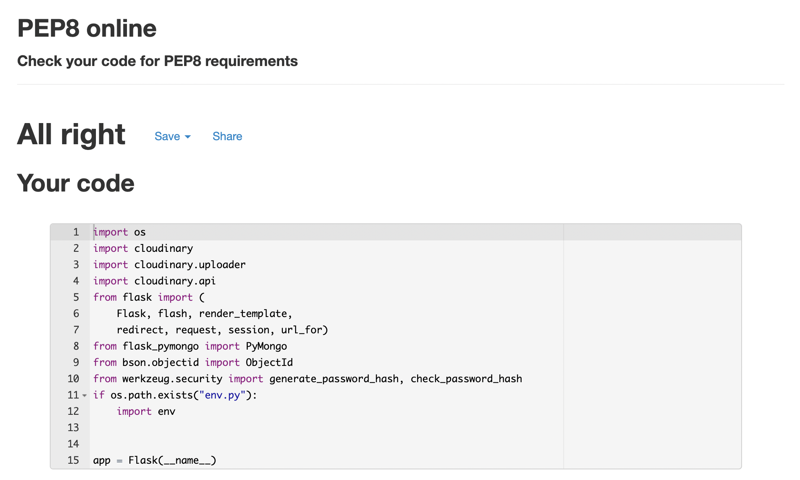

<h1 align="center">Restruction</h1>
<h1 align="center"></h1>

<a href="https://restruction.herokuapp.com/"> : Restruction Deployed on Heroku</a>

<a href="https://github.com/marcusnolan/restruction"> : Restruction Github Repository</a>

## About
The Restruction app was developed to try and create a database where professionals from the construction industry can either advertise or find items 
(materials or objects), that are still very usable but are going to be destroyed or removed form a building due to refurbishment or demolition. This effort 
is to try and combat the 40% that the construction industry claims of the worlds total carbon production every year. <br>
<br>
A lot of this carbon produced is from materials and objects that are being produced for new buildings even though there are perfectly got alternatives available. 
Not only does the production of these items produce carbon but the packaging and shipping can often produce even more carbon than the product itself. If Restruction
can help just one item from unnecessarily being destroyed, it is a victory!

## Table of Contents
**[User Experience](#user-experience)** 

**[Features](#features)**

**[Information Archeticture](#information-architecture)**

**[Technologies Used](#technologies-used)**

**[Testing](#testing)**

**[Deployment](#deployment)**

**[Bugs](#bugs)**

**[Credits](#credits)**


## User Experience

### User Stories
- #### As a general user;
    1. I want to be informed about Restruction's concept.
    2. I want to be able to navigate the website easily. 
    3. I want to see some sample items without having to register or login. 
    4. I want to easily find the register page and login page.
    5. I want to be able to search for exactly what I am looking for without having to trawl through every posted item. 
    6. I want to be able to edit my account.
- #### As a construction industry professional;
    1. I want to understand the format and types of items being displayed without having to register or login. 
    2. I want to be prompted to register as a user. 
    3. I want to easily find the register and login pages. 
    4. I want to be able to post item's myself easily. 
    5. I want to be able to view items and search for items by their name. 
    6. I want to be able to view images of items and upload images of items I have posted. 
    7. I want to be able to edit and delete items I have posted. 
    8. I want to be able to edit my account. 
    9. I want to be able to set specific contact details for the items I post. 
    10. I want to set a date for which the item will be removed. 
- #### As a charity/sustainability officer/self builder;
    1. I want to be informed about Restruction's concept.
    2. I want to be able to navigate the website easily. 
    3. I want to see some sample items without having to register or login. 
    4. I want to easily find the register page and login page. 
    5. I want to be able to contact an item owner easily without having to fill out multiple forms etc. 
    6. I want to determine the condition of the item easily through a description and image. 
    7. I want to be told when the item I am looking at will be removed/destroyed. 
    8. I want to feel that the website has the right ethos and I would feel comfortable supporting it. 


### Design

- #### Colour Scheme
    - The Universal colour for recycling is green. It has always been recognised like that so naturally, I felt Restruction should have green as the main colour. 
    I also wanted it to be light and welcoming to give a positive vibe and emotion as the aim and ethos of Restruction is that of positivity and optimism.
    - The main colour is De York (essentially a Light Green). The Secondary colour is white. The 2 remaining colours in the pallet below are the alternating 
    background colours for the items dropdowns and are Aqua Spring and Alice Blue. <br>
    <br>
    

- #### Typography
    - The Font used throughout the entire website is Raleway. It is a very clean font which I wanted as in general, I want the website to be clean to give the 
    feeling that it and the items posted on it are prestine. 
    <br>
    

- #### Imagery
    - For the Restruction logo, I have used the Universal Recycling Symbol that was originaly designed by a college student back in 1970. As is described in its name, 
    it is universal and one of the most recognizable icons in the world. I used Font Awesome (fa-recycle) and Raleway font saying "Restruction" to create the logo. 
    It is very simple and clean and because it does not feature an image, it is always brilliant quality no matter what screen resolution. <br>
    
    <br>
    - The images on the home page are royalty free images I downloaded from both <a href="https://pixabay.com/">Pixabay</a> and <a href="https://unsplash.com/">Unsplash</a>. 
- #### Wireframes/Mockups
    - The mockup images seen above and below were created using <a href="http://ami.responsivedesign.is/">Am I Responsive</a> and <a href="https://magicmockups.com/">
    Magic Mockups</a>. Wireframes were created using Adobe XD. Both mobile and desktop versions are linked below;
        
        - <a href="./static/images/readme/mockups/home_web.png"> Home - Web</a>
        - <a href="./static/images/readme/mockups/home_mobile.png"> Home - Mobile</a>
        - <a href="./static/images/readme/mockups/items_web.png"> Items - Web</a>
        - <a href="./static/images/readme/mockups/items_mobile.png"> Items - Mobile</a>
        - <a href="./static/images/readme/mockups/login_web.png"> Login/Logout - Web</a>
        - <a href="./static/images/readme/mockups/login_mobile.png"> Login/Logout - Mobile</a>
        - <a href="./static/images/readme/mockups/register_web.png"> Register - Web</a>
        - <a href="./static/images/readme/mockups/register_mobile.png"> Register - Mobile</a>


## Features

### Existing Features

#### Common Features Across All Pages
- **Header** - allows user to easily navigate across all pages
    - Navigation is included in the header to allow easy and quick access. 
    - Python determines if the user is logged in or not by checking if 'user' in session and passes this data to Jinja to display the correct navbar 
    for the user. 
    - When a user is not logged in they will only be shown:
        - Home
        - Login
        - Register
    - Once logged in, the navbar will show the options:
        - Home
        - Items
        - Add Item
        - And a dropdown named "My Account" showing:
            - Profile
            - My Items
            - Log Out
        - If you are logged in as the admin, "Manage Item Types" will also be displayed. 
    - When hovering over items in the navbar, the background of the div they are in gets a slight grey filter to let them know it is clickable and where they are. 
    - On any screen size less than 992px, The navigation items will be hidden and instead a burger menu icon will appear. 
    - upon clicking the burger menu icon, all of the normal options (depending on whether you are logged in or not) will appear in a menu from the right. 
- **Accessibility**
    - All images on the website have got alt tags including uploaded item images which have been given an automated alt tag of "{{ item.item_name }} image" to 
    display without needing the user uploading the item to fill anything out. 
- **Footer**
    - At the bottom of each page there is a footer with the same background colour as the header. 
    - in the left column of the footer is a message requesting people to make contact if they have any issues or suggestions. Below is an email button
    linked to my email address. 
    - In the right column there is the same navigation menu as seen in the header just to increase the ease of navigating the site. 
- **Responsiveness**
    - Using Materialize CSS, all text and items on the site are kept in a container that is set to 70% of the screen width on screens 992px and up. 
    Any screen from 992px to 600px, the container is set to 85% width and anything below 600px is 90%. 
    - As well as this, using the grip option of Materialize, anything that has 2 different elements on the same row (such as the quantity and dimensions of each item), 
    will stack on top of each other on devices less than 600px wide as I set them to s12 (small devices 12 columns) but m6 (medium devices 6 columns). Each row is 12 columns in its entirety. 


### Specific to Pages
- **Home**
    - Home page features a small bit of text outlining the idea of Restruction and its aim. 
    - Towards the bottom, there is a list that shows the 10 most recently posted items from top to bottom, newest to oldest. 
- **Register**
    - Register has got a 5 input form to register to the database. 
    - The form checks both usernames and email to see if there are existing ones on the database. 
    - A Flash message appears if there is an existing Email or Username.  
- **Login**
    - Login features a login form accepting username and password. 
    - There is also a button below the form in case a user has not yet registered. This helps the user experience as if you 
    get lost and do not yet have an account, it is very easy to see where to go. 
- **Items**
    - The Items page is the main browsing page for Restruction. 
    - It features every single posted item. 
        - This is in a collapsible dropdown list. 
        - Each dropdown has all of the specifics of the item, an image and even what user posted it. 
    - It also features a search function that will not only search existing item names but also item descriptions and return all matching items. 
- **Add Item**
    - The add item page consists of a 13 input form; 
        - Item Name
        - Item Type (dropdown)
        - Item Description
        - Quantity 
        - Dimensions
        - Estimated Mass
        - Condition
        - Contact details;
            - Contact Name
            - Contact Email 
            - Contact Phone Number 
        - Date of Removal (date picker)
        - Item Location 
        - Image Upload 
    - The Add Item button at the bottom is the submit button for the form. 
- **Profile**
    - Profile page shows the users username at the top of the page. 
    - Below the username, there is a 3 input form prefilled with the users first name, last name and email. 
    - this form is the edit user function and below it are the 2 buttons;
        - Delete - This obviously deletes the user with defensive programming modal you must click before deleting. 
        - Edit - the submit button for the form. 
- **My Items**
    - My items are very similar to the items page except without the search form and it only shows items created by the logged-in user. 
    - If the user has not posted yet it will say no items found and prompt them to create an item. 
    - Also on the My Items page, each item they have posted has an edit button that will bring them to the edit item page. 
- **Edit Items**
    - Very similar to the Add Item form, the edit item features a 12 input form as users are not allowed to edit their image of the item. 
    - There is a cancel button if a user accidentally pressed the edit button that will bring them back to their posted items. 
    - There is also a Delete button to delete the item (again with defensive programming to avoid accidental deletion). 
    - And of course, the edit button which submits the edit form. 
- **Manage Item Types**
    - This page is only available to the admin of Restruction. 
    - You can view what it looks like <a href="./static/images/readme/manage_item_types_preview.png"> here.</a>
    - There is a large add item type button that brings you to the Add item type page again only viewable to the admin. 
    - You can view what it looks like <a href="./static/images/readme/add_item_type_preview.png"> here.</a>
    - The manage items page features all 14 item types. 
- **404 Error Page**
    - I created a custom 404 page for when someone finds themselves with an incorrect URL. 
    - It tells the user what has gone wrong and then offers them a way to get back on track and also an option to contact the admin team to help fix the problem. 
- **500 Error Page**
    - I created a custom 500 page for when someone finds themselves on a broken page or link. 
    - It tells the user what has gone wrong and then offers them a way to get back on track and also an option to contact the admin team to help fix the problem. 

### Future Features
- Interactive map 
    - In the future, I think an interactive map would be perfect for Reconstruction. 
    - It would feature every single posted item and its location so you could view what items are near you and then click on them to show the item details. 
    - Although this feature would not be a necessity, it would help the usability of the app. 
- 3D object modelling
    - When someone inserts the dimensions, I would like a 3d object to be created through CAD automation so you could see the size and shape more realistically. 
    - Also if the item has a previously drown CAD file, that it could be uploaded and have a viewer within the item view. 

<h1 align="center"></h1>

## Information Architecture 

### Database Choice
While a SQL database may have suited Restruction better, I had a very clear outline of how I wanted the data to segment and organize itself
 and I felt with my skills and experience, MongoDB gave me the best opportunity to achieve a high-quality database that would be easily understood 
 and interacted with. 

### Data Storage Types
The only types of data stored in MongoDB for Restruction are;
- ObjectId
- String
I played with the idea of using DateTime and Boolean but it was unnecessary and overcomplicating things for no reason. Just strings have worked very well for Restruction. 

### Collections Data Structure

Restruction contains three database collections:

#### Users Collection

| Title | Key in DB | Data type |
--- | --- | ---
Account id | _id | ObjectId 
First Name | first_name | string
Last Name | last_name | string
Username | username | string
Email Address | email | string
Password | password | string

#### Items Collection

| Title | Key in DB | Data type |
--- | --- | --- 
Item id | _id | ObjectId 
Item Name | item_name | string
Item Type | item_type | string
Item Description | item_description | string
Quantity | quantity | string
Dimensions  | dimensions  | string
Estimated Mass | estimated_mass | string
Condition | condition | string
Contact Name | contact_name | string
Contact Email | contact_email | string
Contact Phone | contact_phone | string
Date of Removal | date_of_destruction | string
Item Location | item_location | string
Photo URL | photo_url | string
Created By | created_by | string


#### Item Types Collection

| Title | Key in DB | Data type |
--- | --- | --- 
Item id | _id | ObjectId 
Item Type | item_type | string

- The Users collection username is pulled into the add_items form automatically and then stored in the items collection under "created_by". 

## Technologies Used

### Languages Used

- [HTML5](https://en.wikipedia.org/wiki/HTML5)
- [CSS3](https://en.wikipedia.org/wiki/Cascading_Style_Sheets)
- [JavaScript](https://en.wikipedia.org/wiki/JavaScript)
- [Python](https://en.wikipedia.org/wiki/Python_(programming_language))

### Frameworks, Libraries, and Programs Used

- [PIP](https://pip.pypa.io/en/stable/installing/) - PIP was used to install the tools needed for Restruction. 
- [Git](https://gist.github.com/derhuerst/1b15ff4652a867391f03) - Git was used for handling version control. 
- [MongoDB](https://www.mongodb.com/cloud/atlas) - MongoDB was used as the Database for Restruction. 
- [Github](https://github.com/) - Github was used to store the code remotely. 
- [GitPod](https://www.gitpod.io/) - GitPod, connected to GitHub, hosted the coding space and allowed the projected to be committed to the Github repository.
- [Heroku](https://www.heroku.com/home) - Heroku is where Restruction was deployed. 
- [jquery](https://jquery.com/) - jQuery was used to help DOM manipulation.
- [Jasmine](https://jasmine.github.io/) - Jasmine was 
- [Font Awesome](https://fontawesome.com/) - Font Awesome was used to add all the icons on the site.
- [Google Fonts](https://fonts.google.com/) - Google Fonts was used to import the 'Raleway' font in the style.css stylesheet.
- [Photoshop](https://www.adobe.com/ie/products/photoshop.html) - Photoshop was used to resize any images used on the site.
- [Adobe XD](https://www.adobe.com/ie/products/xd.html) - Adobe XD was used to create wireframes and mockups.
- [W3C Validator](https://validator.w3.org/#validate_by_uri) - This was used to validate the HTML code outlined in testing below.
- [W3C CSS Validator](https://jigsaw.w3.org/css-validator/validator) - This was used to validate the CSS code outlined in testing below.
- [JShint](https://jshint.com/) - This was used to validate the JavaScript code outlined in the testing below.
- [PEP8 Online Check](http://pep8online.com/checkresult) - This was used to validate that all Python code was PEP8 compliant outlined in testing below.
- [Extends Class Python Syntax Checker](https://extendsclass.com/python-tester.html) - This was used to validate the syntax of all Python code outlined in testing below.


## Testing

 ### Functionality Testing
- #### Navigation bar
    - All links and buttons have been tested and are working. 
    - The mobile menu button appears on screens smaller than 992px wide and when clicked it reveals the mobile menu sidebar from the right. 
- #### Footer
    - All links and buttons have been tested and are working. 
    - The email button in contact triggers the user's local email server for ease of use. 
- #### Home page
    - collapsible dropdown if 10 most recent items work correctly and only features ten and they are in the correct order, newest to oldest. 
- #### Register
    - Once the form is filled out, the account is registered and automatically logged in. 
    - The 'login' button below the register form brings the user to the login page. 
- #### Login
    - The login form works correctly and puts the user into session. 
    The 'register account' button below the login form brings people to the register page. 
- #### Logout
    - When clicking log out within the 'my profile' dropdown the user is promptly logged out and brought to the login page. 
- #### Add Item
    - The 'add item' form and all its elements work correctly. Once submitted the item is added to the database. 
    - The add image button works correctly and uploads the image to Cloudinary. 
    - All fields set as required work correctly as do all min and max lengths for inputs. 
- #### Edit Item
    - All fields are preloaded with the details of the existing item when you go to edit an item. 
    - The Image field is not editable as users should only ever change small details such as mass, quantity, dimensions or contact details.
    if a user is looking to edit the image they should have to repost for accuracy. 
    - When the form is refilled and the edit button clicked, the item is updated on the database. 
- #### Delete Item
    - When in the edit item page, the delete item button works correctly and produces a modal. 
    - This modal is some defensive programming to make sure whoever clicks the delete button has intended on it so you must click a 'permanently delete' button after to double-check. 
- #### Edit User
    - When clicking on the profile option within the "my account" dropdown, you are brought to the profile page which contains the edit user function. 
    - The user's information is preloaded and when changed, the edit user button submits the changes correctly. 
    - The user can only change their first name, last name and email. We do not want users changing their username or password. 
- #### Add Item Type
    - This function is only available to the user 'admin' which I have control of. 
    - it works perfectly and looks like this;

    
- #### Edit/Delete Item Type
    - These functions are only available to the user 'admin' which I have control of. 
    - they work perfectly and looks like this;
    
    
- #### Search Items
    - On the 'items' page, the search form works when a user enters the term of the item they are looking for. 
    - The form is then submitted with the button and it searches all items both names and descriptions for the term in question. 
    - the reset button resets the search and clears the form. 

### CSS3 validator - Pass
<a href="https://jigsaw.w3.org/css-validator/validator">
        - Restruction
    </a>


### HTML5 validator
- Seen as you can't validate jinja, rather than input each page of HTML directly into the validator, I had to paste the deployed links into the w3 validator. 
- After an h4 tweak that was showing in the mobile menu, each page passed the validator with no errors and just one warning that was due to the jinja for loop for flash messages.  
 

### JavaScript validator (JShint)
- At the top of the script I had to let JShint know that I was using Jquery and also ES6 to avoid it giving errors for both of them. 
- After that, there were no errors. 
 

### Python Syntax Checker 
- To check python syntax I used an online checker cited above in technologies used. 
- It determined there are no syntax errors in my python. 
 

### PEP8 Python Checker 
- To check my compliance with PEP8, I used an online checker cited above in technologies used. 
- It determined that my python was perfectly compliant. 
 

### Testing User Stories form User Experience (UX) section
- #### As a general user;
    1. I want to be informed about Restruction's concept.
        - Upon arrival on the home page, the first thing a user sees as they scroll is the paragraphs explaining reconstruction and its concept. 

            
    2. I want to be able to navigate the website easily. 
        - The navbar is very obvious at the top of the page and consistent throughout the site. The footer also contains a menu for more ease of navigation. 

            
            
    3. I want to see some sample items without having to register or login. 
        - The home page features the 10 most recently posted items for anyone to see, not just logged in users. 

            
    4. I want to easily find the register page and login page.
        - When a user has not yet registered or logged in, the login and register buttons are very visible in the navbar and footer menu. 

            
    5. I want to be able to search for exactly what I am looking for without having to trawl through every posted item. 
        - Once a user is logged in, there is an intuitive search that searches both item names and item descriptions for whatever the user is searching for. 

            
    6. I want to be able to edit my account.
        - A user can edit their first name, last name and email via the profile page. 

            
- #### As a construction industry professional;
    1. I want to understand the format and types of items being displayed without having to register or login. 
        - Before logging in, a user can check the format of each posted item via the 10 most recent items on the home page. 

            
    2. I want to be prompted to register as a user. 
        - In the second paragraph it states "Register via the button at the top right and join the movement if you work within the construction industry" prompting industry professionals to register. 

            
    3. I want to easily find the register and login page's. 
        - When a user has not yet registered or logged in, the login and register buttons are very visible in the navbar and footer menu.

            
    4. I want to be able to post item's myself easily. 
        - The Add Items page is very easy to locate and features a simple form that is easily understood and used. 

            
    5. I want to be able to view items and search for items by their name. 
        - On the All Items page, there is an intuitive search that searches both item names and item descriptions for whatever the user is searching for.

            
    6. I want to be able to view images of items and upload my own images of items I have posted. 
        - Each posted item has an image section that shows the uploaded image at 50% width of the div and auto height. 

            
    7. I want to be able to edit and delete items I have posted. 
        - The edit item function intuitively preloads what a user has uploaded previously so they can just edit the text there and click edit to save. 
        - The delete button also works correctly with some defensive programming to make sure a user has not accidentally deleted an item. 

            
    8. I want to be able to edit my account. 
        - A user can edit their first name, last name and email via the profile page.

            
    9. I want to be able to set specific contact details for the items I post. 
        - Rather than just taking the users details and preloading the item with them, the user posting can set whoever they like as the contact as they may only be posting on behalf of someone. 

            
    10. I want to set a date for which the item will be removed. 
        - The add item form features a date picker for the date of removal which users can then see when viewing the item. 

            
- #### As a charity/sustainability officer/self builder;
    1. I want to be informed about Restruction's concept.
        - Upon arrival on the home page, the first thing a user sees as they scroll is the paragraphs explaining reconstruction and its concept. 

            
    2. I want to be able to navigate the website easily. 
        - The navbar is very obvious at the top of the page and consistent throughout the site. The footer also contains a menu for more ease of navigation.

            
    3. I want to see some sample items without having to register or login. 
        - The home page features the 10 most recently posted items for anyone to see, not just logged in users.

            
    4. I want to easily find the register page and login page. 
        - When a user has not yet registered or logged in, the login and register buttons are very visible in the navbar and footer menu.


            
    5. I want to be able to contact an item owner easily without having to fill out multiple forms etc. 
        - Contact details are shown on each item and you can do with them as you like rather than having to contact via email forms etc. 
        - The email and phone also intuitively trigger the device's default email service and phone service when clicked for user experience. 

            
    6. I want to determine the items condition easily through a description and image. 
        - Each item features a condition section where the poster can describe its current condition. 
        - The image feature also means the user can determine the condition of the item themselves. 

            
    7. I want to be told when the item I am looking at will be removed/destroyed. 
        - Each item has a date of removal date picker that the poster has selected when the item will be removed. 

            
    8. I want to feel that the website has the right ethos and I would feel comfortable supporting it. 
        - The website features a welcoming light green colour Scheme and also has a light tone with wording to create a positive ethos. 

            

### Usability Testing
- To test all aspects of Restruction, I had a few friends and family check out the site for any errors or glitches I didn't find. 
- I also had my sister and a few of her architect friends register and add a few items while also testing links, functions and responsiveness with their different mobiles and tablets. 
- Overall, the testers came from a variety of ages and backgrounds so they had a varying ability with regards to tech. 

### Compatibility Testing
- Browser Compatibility on mobile, tablet and desktop;
    - Safari - successfull 
    - Chrome - successfull 
    - Firefox - successfull 

- OS Compatibility was tested on iOS 14.4.2, Android 11.0, macOS Big Sur 11.0.1, iPad OS 14.2, and Windows 10. 
- The devices used in this testing include Macbook Pro m1, Dell laptop, iPad Pro 12 inch, iPhone 12 Pro Max, iPhone 6s, Samsung s9, and other android mobile phones.


### Fixed Bugs
- Edit User Bug
    - The original bug was presented to me by jinja saying I had a problem with my h3 on the profile page that just took the users username in the h3 but jinja was showing an error. 
    - Seen as I was only letting users edit their name and email on their account, whenever a user went to do so, their username and password were then deleted. I was baffled by this and spent 
    a lot of time trying to get it right. I knew the problem was that I was updating all 5 fields but not passing any details for username and password so they were being deleted and 
    then my h3 could not find a username so the error was showing. 
    - I knew the fix was to use a $set when updating Mongo but even when I had that in perfectly, it would not work. 
    - I eventually realized it was because I was calling users when I should have been calling for a user. It was then fixed and working perfectly. 
- Search for an existing username OR email when registering
    - Although it may have been slightly unnecessary and caused me a lot of time, I wanted the register function to search for both existing username and email when registering a new user. 
    - I spent a huge amount of time going through different documentation on MongoDB etc and could not get it working until I realised with pymongo, it will not accept a $or statement without it 
    being in speech marks and each statement in the "$or" must be aligned perfectly with each other. 
    - I managed to troubleshoot myself and learnt an incredible amount just from spending hours on this one problem. 
- Uploading images
    - Similarly to the above, while it may have been unnecessary for the requirements for the project, I really wanted to let my users be able to upload an image from their device rather than uploading
    a URL to the add_item form. I spent quite a bit of time and my mentor and people on slack tried to talk me out of it and get to move on but I really wanted that functionality, no matter how 
    long it took. 
    - Originally I was going to try MongoDB Grid but I kept on hearing about Cloudinary on slack and online so I registered and thought I had everything wired up correctly but I was getting nowhere. 
    - I was getting the photo from the form, passing it into Cloudinary, getting the secure_url and passing it into a review dictionary - but then I wasn’t doing anything with that dictionary. 
    - I had to pass all the data together with the other data from the form into the item dictionary whereas I was doing it separately. 

### Ongoing Bugs
- There are currently no ongoing bugs. 

## Deployment 

### Deploying Restruction
Restruction was deployed using [Heroku](https://www.heroku.com/home). The procedure is outlined below.
1. Create a `requirements.txt` file using the terminal command `pip freeze > requirements.txt`.
2. Create a `Procfile` with the terminal command echo web: `python app.py > Procfile`.
3. `git add` and `git commit` the new requirements and Procfile and then `git push` the project to GitHub.
4. Create a new app on the Heroku website by clicking the "New" button in your dashboard. Give it a name and set the region to Europe.
5. From the Heroku dashboard of your newly created application, click on "Deploy" > "Deployment method" and select GitHub.
6. Confirm the linking of the Heroku app to the correct GitHub repository.
7. In the Heroku dashboard for the application, click on "Settings" > "Reveal Config Vars".
8. Set the following config vars:

| Key | Value |
 --- | ---
IP | 0.0.0.0
MONGO_DBNAME | (e.g) restruction
MONGO_URI | `mongodb+srv://<username>:<password>@<cluster_name>.6zpoa.mongodb.net/<database_name>?retryWrites=true&w=majority`
PORT | 5000
SECRET_KEY | `<your_secret_key>`
- I am also using Cloudinary API for images so you must add 3 more config variables at a later stage to Heroku for that to work. 
- To get you MONGO_URI read the MongoDB Atlas documentation [here](https://docs.atlas.mongodb.com/)

8. In the Heroku dashboard, click "Deploy".

9. In the "Manual Deployment" section of this page, making sure the master branch is selected and then click "Deploy Branch".

10. The site is now successfully deployed.

### Cloning 
If you wish to clone run a version of the site locally, you can clone this repository using the following steps;
1. Go to the GitHub website and log in.
2. Locate the [Repository](https://github.com/marcusnolan/Milestone-2-Go-Phish) used for this project.
3. Under the Repository name locate 'the 'code' button which is to the left of the 'gitpod' button in green.
4. To clone the repository using HTTPS click the link under Clone  "HTTPS".
5. Open your Terminal and go to a directory where you want the cloned directory to be copied in.
6. Type `Git Clone` and paste the URL you copied from GitHub.
7. To create your local clone press `Enter`

### Installing requirements
- Install all requirements modules to your local IDE with the following CL:

```
 pip3 install -r requirements.txt
```

#### Creating a Collection in MongoDB
- Login to your MongoDB account
- Create a Cluster
- Create a database using whatever architecture you prefer. The Restruction architecture is listed above in **[Information Archeticture](#information-architecture)**

#### Setup Environmental Variables
- Create a '.gitignore' file in the root directory
- Add 'env.py' and '__pycache__/' to the file list within .gitignore
- Create an 'env.py' file
- In the 'env.py' file write the following code;

```
import os

os.environ.setdefault("IP", "0.0.0.0")
os.environ.setdefault("MONGO_DBNAME", "[UNIQUE ID]")
os.environ.setdefault("MONGO_URI", "[UNIQUE ID]")
os.environ.setdefault("PORT", "5000")
os.environ.setdefault("SECRET_KEY", "[UNIQUE ID]")

```

Note: For each section noted as [UNIQUE ID], you will need to provide your own unique identifier. These must also be aligned to Heroku environmental variables outlined above.

### Setup Unique Identifies / Environment Variables

#### SECRET_KEY

This is required when using flash() and session() functions in flask. The key can be whatever you want, but it's advisable to use a randomly generated secure key.

#### MONGO_URI

This is used to connect your application to your MongoDB cluster.

- Click the 'Overview' tab from your Cluster, followed by 'Connect'.
- Select 'Connect your application' from the window that opens.
- Select your correct version of Python and copy the connection string.
- Replace the 'username' and 'password' text, with the relevant criteria you set up in 'Database Access'.

#### MONGO_DBNAME

This is the name of your database in MongoDB. Which can be found under the 'Collections' tab, under your cluster. (e.g restruction)

#### Running Development Server

To launch an HTTP server using the development mode code for the application, use the following command in your IDE:

```

python3 app.py http.server

```

The IDE will then open a port with HTTP address for you to access.


## Credits

### Code
- All the code written for Restruction was written by me. 
- For the basics of the site I followed Code Institutes recorded videos but for all additional features, I went off-piste and pushed my ability. 
- I also use Materialize CSS as a framework which was helped a huge amount. 

### Content 
- Writing up the README file;
    - I used my previous README from my MS2 project that received good feedback but needed a few changes. 
    - I also took inspiration from a few alumni such as Anna Greaves on her MS3 README. 
- All content on the site was written by myself. 

### Media 
- I downloaded both images on the home page via [pixabay](https://pixabay.com/) and [Unsplash](https://unsplash.com/) which are two fantastic 
royalty-free image websites. 

### Acknowledgements
- My biggest thank you has to go out to my wonderful sister Andrea who is an Architect in London for a brilliant firm that does an awful lot for the industry and the environment. 
They are one of the most progressive firms in the country and do some incredible work. 
- She gave me the idea for Restruction and as soon as she said it to me, I was hooked. 
- Thank you to everyone who took their time to provide me constructive feedback on the Slack community page (especially Igor and Anna) and of course my friends and family.
- Also the tutor team were very helpful on one or two topics I was struggling with so I must thank them. 
- Big thanks to my mentor for putting up with my many questions, giving me great insights, and going above and beyond their position to help me.